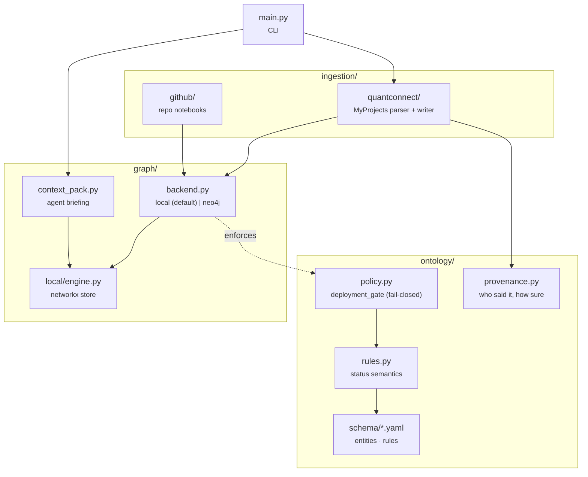

# agent_graph_system — Agentic Graph Ontology System

A knowledge-graph layer over the Q-agent workspace. It ingests repos and
QuantConnect projects into a typed graph of **entities** (Strategy, Backtest,
Dataset, Notebook, …) and **relationships** (USES, DEPLOYS_TO, HAS_BACKTEST, …),
enforces a small set of **write-time safety rules**, tracks **provenance** on
every fact, and assembles **context packs** so coding agents start a task
already knowing what a project is made of.

> This subsystem is independent of the LEAN algorithm workflow documented in the
> repo root `claude.md` / `AGENTS.md`. It has its own dependencies
> (`requirements.txt`) and its own tests (`tests/agent_graph_system/`).

## Design principle: metadata describes, it does not enforce

The guiding rule throughout: **the graph must never imply a safety guarantee the
code does not actually provide.** Three layers cooperate to keep that honest:

```
rules.yaml  ──>  rules.py     a rule is a hard gate ONLY when
(metadata)       (status)     status=enforced AND severity=blocking
                    │
                    v
                 policy.py    fail-closed enforcement at write time
                    │         (e.g. deployment_gate before a live DEPLOYS_TO)
                    v
              provenance.py   every fact records who asserted it and how
                              much to trust it (declared / extracted / …)
```

A `blocking` severity on a non-`enforced` rule is surfaced as a *warning*, never
silently treated as a guarantee. A low-confidence extracted fact is surfaced
*separately* from authoritative ones, never blended in.

## Architecture



| Path | Responsibility |
|---|---|
| `config.py` | Env-driven config (Neo4j, Chroma, GitHub, API, `ontology_dir`). |
| `ontology/rules.py` | Load `rules.yaml`; `Rule.is_hard_gate`; warn on inconsistent metadata. |
| `ontology/policy.py` | Write-time enforcement (`check_deployment_gate`, `PolicyViolation`). |
| `ontology/provenance.py` | `Provenance` value object + helpers. |
| `ontology/schema/entities.yaml` | Entity properties + the shared `provenance_fields` block. |
| `graph/backend.py` | Backend selector — `local` (default) or `neo4j`. |
| `graph/local/engine.py` | In-process networkx graph; `merge_node`/`merge_relationship`. |
| `graph/context_pack.py` | Build a per-project context pack (markdown / JSON). |
| `ingestion/github/` | Generic repo → notebook/dataset graph. |
| `ingestion/quantconnect/` | MyProjects atomic-project parser + graph writer. |
| `rag/`, `agents/`, `api/` | GraphRAG retrieval, agents, FastAPI server. |
| `main.py` | CLI entry point (see below). |

## Backends

The default backend is an **in-process networkx graph** persisted to
`.local_graph.pkl` — no server required. Set `GRAPH_BACKEND=neo4j` (with
`NEO4J_*` env vars, see [`CREDENTIALS.md`](../CREDENTIALS.md)) to target a live
Neo4j; if it is unreachable the code falls back to the local engine.

> The local engine is the only fully-implemented backend. `merge_node` /
> `merge_relationship`, provenance, ingestion, and context packs all target it.
> Neo4j parity for the newer write-path features is a tracked follow-up.

## Ontology rules & the deployment gate

Rules in `ontology/schema/rules.yaml` carry an explicit `status`:

| status | meaning |
|---|---|
| `proposed` | an idea only; never enforced |
| `documented` | describes current behaviour / guidance; not a gate |
| `enforced` | code MUST enforce it (see `policy.py`) |
| `disabled` | explicitly off; ignored everywhere |

The flagship enforced rule is **`deployment_gate`**: a Strategy may only get a
live `DEPLOYS_TO` edge when its latest completed Backtest clears the Sharpe
threshold. Enforcement is **fail-closed** — a missing or failing backtest denies
the write — and only applies to *live* environments (`paper`/`staging` are where
un-validated strategies are meant to run). `graph_models.strategy_deploys_to`
calls `check_deployment_gate` and raises `PolicyViolation` on denial.

"Latest backtest" selection (`latest_backtest_for_strategy`) links via a
`HAS_BACKTEST` edge **or** a `strategy` property, excludes failed/running runs,
and orders by `completed_at → run_date → created_at → updated_at`.

## Provenance

Every node or edge can carry a flat provenance block (stored under the `prov_`
prefix so it never collides with domain properties):

| field | meaning |
|---|---|
| `extractor` | which component asserted the fact |
| `assertion_type` | `declared` · `extracted` · `inferred` · `learned` |
| `source_file`, `line` | where it was read from (optional) |
| `confidence` | 0.0–1.0 trust score |
| `source_hash` | hash of the source span, for change detection |
| `observed_at` | first time the fact was seen |
| `last_seen` | most recent re-observation |

```python
from agent_graph_system.graph.backend import merge_node
from agent_graph_system.ontology.provenance import Provenance

merge_node("Signal", "name", "rolling_beta",
           provenance=Provenance.extracted("my_extractor",
                                            source_file="signals/beta.py",
                                            line=12, confidence=0.9))
```

Re-running an extractor preserves the original `observed_at` and bumps
`last_seen`. `is_low_confidence(props)` lets consumers separate trustworthy facts
from guesses; the context pack uses it to isolate a "low-confidence facts"
section.

## MyProjects ingestion (`ingestion/quantconnect/`)

`parser.parse_project` is **pure** (AST + path classification, no graph imports)
and inventories an atomic LEAN project: files, docs (`AGENTS.md`, `claude.md`,
`README.md`, `docs/*.md`), modules (classes), signal atoms
(functions in `domain/signals/`), config params, data subscriptions, bundled
`data/*.csv`, ObjectStore reads/writes, and research notebooks. Constants like
`BENCHMARK`/`TRUMP_PROB_CSV` are resolved; loop-variable / f-string keys are
flagged at low confidence rather than guessed.

`graph_writer.ingest_project` writes the inventory as nodes and edges, each
stamped with provenance:

- **Nodes:** `Project`, `Strategy` (same name → deployment-gate lineage applies),
  `File`, `Module`, `Signal`, `ConfigParam`, `Dataset`, `ObjectStoreKey`,
  `ResearchNotebook`.
- **Edges:** `CONTAINS`, `HAS_DOC`, `DEFINES`, `USES`, `WRITES`, `READS`.

`File`/`ResearchNotebook` nodes are keyed by a **project-qualified path**
(`{project}/{rel}`, with `rel_path` kept for display) so two projects that both
contain `main.py` never collapse onto one node.

**Re-ingest semantics.** Each run shares one `run_ts`, stamped as provenance
`last_seen` and recorded on the Project node as `last_ingest_run`. Re-ingest is
merge-only (nothing is deleted), but stale facts keep their older `last_seen`,
so the context pack filters them out and reflects the project *as it is on disk
now*.

## Context packs (`graph/context_pack.py`)

`build_context_pack(project)` reads the ingested graph and returns a structured
briefing — summary, recommended files to read first, docs, datasets,
ObjectStore I/O, backtest metrics, signals/modules, config, **known risks**, and
a separate **low-confidence facts** section. `render_markdown(pack)` renders it.

Risks are derived honestly: no completed backtest → "a live deployment_gate
check would fail closed"; unresolved (runtime-computed) ObjectStore keys and
low-confidence facts are each called out.

## CLI

```bash
# from the repo root, with this subsystem's deps installed:
#   pip install -r agent_graph_system/requirements.txt
python -m agent_graph_system.main <command>
```

| Command | Purpose |
|---|---|
| `init` | Bootstrap indexes and seed agents/pipelines/datasets. |
| `ingest --repo <path> [--url <url>]` | Ingest a generic repo's notebooks. |
| `ingest-project <path>` | Ingest one MyProjects/ QuantConnect project. |
| `context-pack <path> [--format md\|json] [--no-ingest]` | Build a project context pack (re-ingests from disk first unless `--no-ingest`). |
| `query <name> [question]` | Named Cypher query or `rag` GraphRAG search. |
| `agent <name>` | Run an agent (coding / monitoring / orchestration / research). |
| `api` | Start the FastAPI server. |
| `status` | Node / relationship counts. |

```bash
# Worked example — brief an agent on the reference project:
python -m agent_graph_system.main context-pack MyProjects/ElectionIndustryBeta --format md
```

## Testing

```bash
pip install -r requirements-dev.txt          # repo root: pytest + networkx + pyyaml
python -m pytest tests/agent_graph_system/ -q
```

The suite covers rule status semantics, the deployment gate, latest-backtest
selection, provenance round-tripping, QuantConnect ingestion (golden fixture:
`MyProjects/ElectionIndustryBeta`), and context-pack assembly — all against the
local backend with an isolated in-memory graph (see
`tests/agent_graph_system/conftest.py`).
