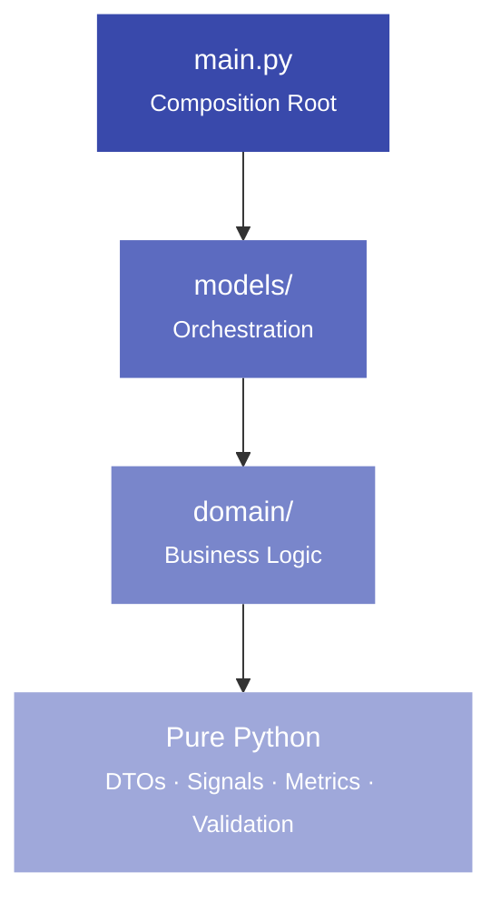
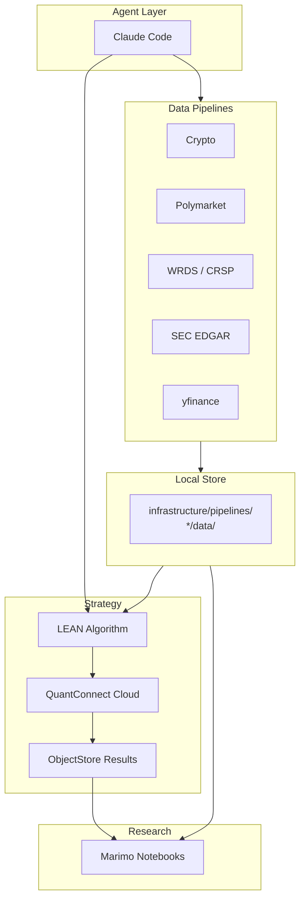
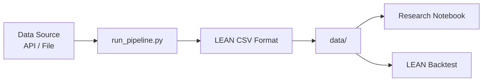

# Architecture

Projects in this workspace follow an atomic architecture that keeps composition thin, orchestration isolated, and business logic testable.

## Strategy layer diagram



## Full workspace flow



## Pipeline flow



---

## Layers

### Composition Root — `main.py`

Wires the project together. Responsibilities:

- Scheduling
- Event routing
- Dependency construction
- Top-level orchestration

The composition root should be thin. If logic is drifting into `main.py`, it belongs in `models/`.

### Models Layer — `models/`

Orchestration and domain coordination. Responsibilities:

- Strategy coordination
- Signal orchestration
- Portfolio orchestration
- Risk orchestration

Models depend on domain. They do not depend on each other.

### Domain Layer — `domain/`

Reusable business logic. Responsibilities:

- Calculations
- Validation
- DTOs
- Metrics
- Pure functions

Domain modules have no LEAN imports. They are testable with plain `pytest` without instantiating an algorithm.

---

## Shared signals library

`MyProjects/shared/signals/` is the canonical source for reusable signal atoms. Projects consume them via symlinks — `lean cloud push` follows symlinks so QuantConnect cloud sees a normal file.

```
shared/signals/
├── momentum.py         ← pure Python
├── mean_reversion.py
└── volatility.py

MyFirstStrategy/
└── domain/
    └── signals/
        ├── momentum.py → ../../shared/signals/momentum.py
        └── mean_reversion.py → ../../shared/signals/mean_reversion.py
```

---

## Goals

- **Testability**: domain logic runs without LEAN
- **Reduced coupling**: layers depend only downward
- **Reusable research**: signals live in `shared/`, not inside projects
- **Readability for students**: each layer has a single clear responsibility
- **Safe AI-assisted development**: the structure gives agents a predictable target
