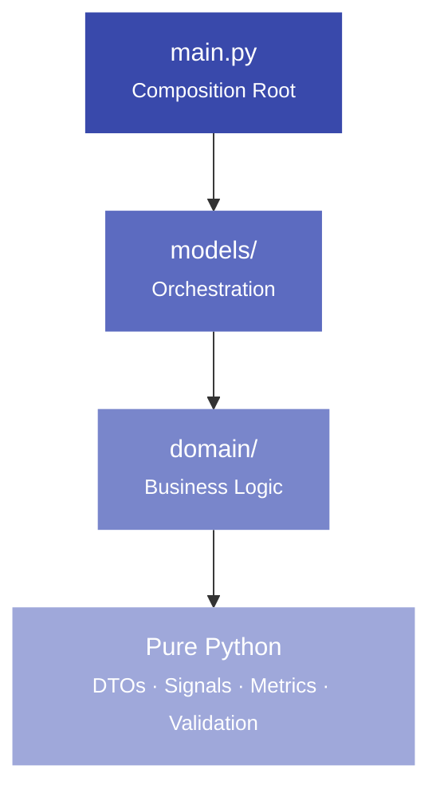
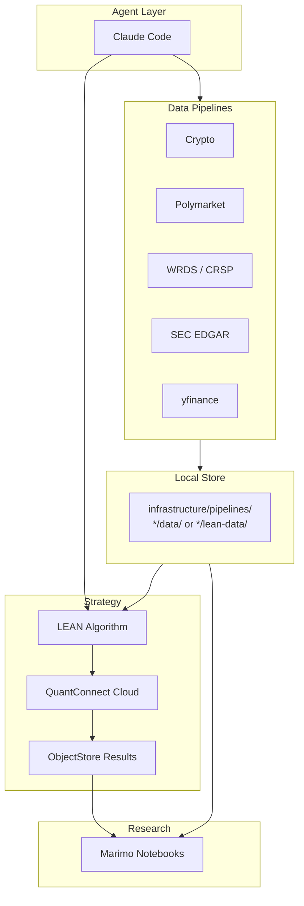
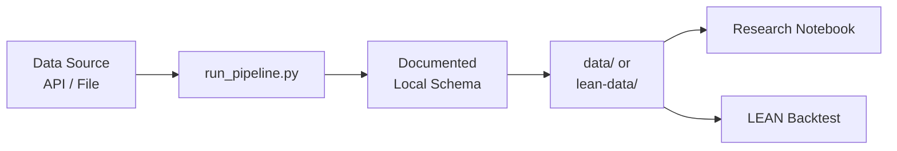
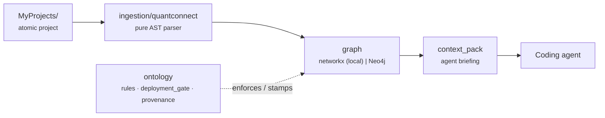
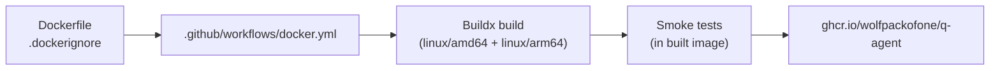

# Architecture

Projects in this workspace follow an atomic architecture that keeps composition thin, orchestration isolated, and business logic testable.

## Strategy layer diagram



## Full workspace flow



## Pipeline flow



`data/` is used for raw, intermediate, or research CSV outputs. `lean-data/` is used for LEAN-ready local data folders that can be pointed to from `lean.json`. Individual pipeline pages document the exact output path.

---

## Layers

### Composition Root — `main.py`

Wires the project together. Responsibilities:

- Scheduling
- Event routing
- Dependency construction
- Top-level orchestration

The composition root should be thin. If logic is drifting into `main.py`, it belongs in `models/`.

### Models Layer — `models/`

Orchestration and domain coordination. Responsibilities:

- Strategy coordination
- Signal orchestration
- Portfolio orchestration
- Risk orchestration

Models depend on domain. They do not depend on each other.

### Domain Layer — `domain/`

Reusable business logic. Responsibilities:

- Calculations
- Validation
- DTOs
- Metrics
- Pure functions

Domain modules have no LEAN imports. They are testable with plain `pytest` without instantiating an algorithm.

---

## Shared signals library

`MyProjects/shared/signals/` is the canonical source for reusable signal atoms. Projects consume them via symlinks — `lean cloud push` follows symlinks so QuantConnect cloud sees a normal file.

```
shared/signals/
├── momentum.py         ← pure Python
├── mean_reversion.py
└── volatility.py

MyFirstStrategy/
└── domain/
    └── signals/
        ├── momentum.py → ../../shared/signals/momentum.py
        └── mean_reversion.py → ../../shared/signals/mean_reversion.py
```

Create a link from inside the project's `domain/signals/` directory:

```bash
cd MyProjects/MyFirstStrategy/domain/signals
ln -s ../../../shared/signals/momentum.py momentum.py
```

### Windows / no-symlink fallback

Symlinks are not guaranteed everywhere: on Windows they need Developer Mode or admin rights, and a repo unzipped from a GitHub ZIP (rather than cloned) can materialise links as plain text files. Two reliable options:

- **Git symlinks on Windows** — clone with symlink support and the links in this repo resolve normally:

  ```powershell
  git config --global core.symlinks true
  git clone https://github.com/WolfpackOfOne/Q-agent.git
  ```

- **Copy instead of link** — if symlinks are unavailable, copy the signal in and keep it in sync manually. The trade-off is you must re-copy when the shared atom changes:

  ```powershell
  copy ..\..\..\shared\signals\momentum.py momentum.py   # Windows
  ```
  ```bash
  cp ../../../shared/signals/momentum.py momentum.py       # macOS / Linux
  ```

`lean cloud push` follows symlinks, so the linked form is preferred when it works; the copy fallback only exists so onboarding never hard-blocks on symlink support. To check whether a link resolved correctly, confirm the file has real Python content (`cat` it) rather than a one-line path string.

---

## Goals

- **Testability**: domain logic runs without LEAN
- **Reduced coupling**: layers depend only downward
- **Reusable research**: signals live in `shared/`, not inside projects
- **Readability for students**: each layer has a single clear responsibility
- **Safe AI-assisted development**: the structure gives agents a predictable target

---

## Knowledge-graph subsystem — `agent_graph_system/`

A separate, optional layer that ingests repos and QuantConnect projects into a typed knowledge graph, enforces a few write-time safety rules, tracks provenance on every fact, and assembles per-project **context packs** for coding agents. It is independent of the LEAN strategy workflow above and has its own dependencies and tests.



Its core principle is **honesty over enforcement**: graph metadata must never imply a safety guarantee the code does not actually provide. A rule is a hard gate only when it is both `enforced` and `blocking`; the `deployment_gate` that guards live `DEPLOYS_TO` edges is fail-closed; and low-confidence extracted facts are surfaced separately from authoritative ones.

```bash
python -m agent_graph_system.main ingest-project MyProjects/ElectionIndustryBeta
python -m agent_graph_system.main context-pack MyProjects/ElectionIndustryBeta --format md
python -m agent_graph_system.main ingest-paper 2401.12345
```

A separate `ingestion/papers/` module fetches and parses arXiv papers into `Paper`/`PaperSection` nodes (and `Strategy -[CITES]-> Paper` edges), using the same provenance scheme extended with document-anchored fields (`source_kind`, `page`, `quote`, ...).

Full reference and CLI: see `agent_graph_system/README.md` and `agent_graph_system/claude.md` in the repository root.

---

## Runtime artifact: the workspace Docker image

The workspace publishes a single runtime image to GitHub Container Registry on every push to `main`:

```
ghcr.io/wolfpackofone/q-agent:latest   # tracks main
ghcr.io/wolfpackofone/q-agent:sha-<x>  # per-commit
ghcr.io/wolfpackofone/q-agent:vX.Y.Z   # version tags
```

The image bundles three things that today require three separate host venvs:

- **LEAN CLI** (`lean`), pinned via the `LEAN_VERSION` build arg
- **Infrastructure pipelines** (crypto / Polymarket / EDGAR / WRDS / yfinance)
- **marimo** with its plotting stack

Build pipeline:



`.dockerignore` mirrors `.gitignore` and additionally excludes the LEAN engine checkout, `References/`, the rendered mkdocs site, all per-user data directories, and every `MyProjects/*/` subtree except the `ElectionIndustryBeta/` reference example. The image runs as non-root `qagent` (uid 1000) and contains no credentials — `lean.json`, `.env`, and `config.json` files are mounted in at runtime, never baked.

The image deliberately does **not** support `lean backtest` (local). That command spawns a nested `quantconnect/lean` Docker container, which would require either the Docker socket (privilege escalation) or Docker-in-Docker. `lean cloud backtest` works inside the container; `lean backtest` runs on the host. Tracked as issue #27.

For build commands, smoke-test recipe, GHCR pull verification, and the six known gotchas, see [Docker](docker.md) and the `/docker-workflow` skill at `.claude/skills/docker-workflow/SKILL.md`.
