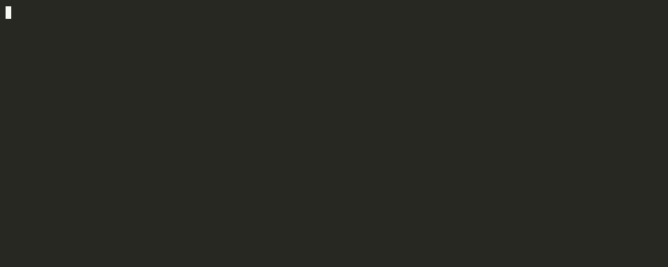

# Getting Started

This guide explains how to set up the Q-agent workspace locally.

## Prerequisites

Install the following:

- Python 3.8+
- Git
- Docker Desktop
- QuantConnect account

## Clone the Repository

```bash
git clone https://github.com/WolfpackOfOne/Q-agent.git
cd Q-agent
```

## Create a Virtual Environment

```bash
python3 -m venv venv
source venv/bin/activate
```

## Install LEAN CLI

```bash
pip install --upgrade pip
pip install lean
```

## Configure QuantConnect

```bash
cd MyProjects
lean init
lean login
```

## Verify Installation

```bash
lean --version
```



## Recommended Workflow

- Keep strategy logic modular
- Use notebooks for research and diagnostics
- Keep reusable code in domain modules
- Avoid committing local data
- Use feature branches for experimental work
