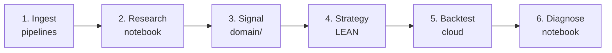

# Golden Path: A Complete Worked Example

This is the single end-to-end walkthrough the rest of the docs build toward: one hypothesis taken from raw data all the way to a backtest you can diagnose. Every command on this page runs against files that exist in the repository today.

The worked example is **Crypto × Prediction Markets** — does Bitcoin react to political event probabilities? — because it needs no paid credentials and reuses the pipelines and notebook already shipped in the repo.



!!! info "What runs today vs. what you build"
    **Stages 1–2 run as-is** with the committed pipelines and the
    `crypto_polymarket_correlation.py` notebook — no account required.
    **Stages 3–6** are a worked example built on the `MyProjects/_template`
    scaffold; the signal and strategy code below is illustrative and the
    backtest needs a free QuantConnect account. The point is to show the
    *shape* of a complete project, not to ship a profitable strategy.

---

## Stage 1 — Ingest data

All pipelines share one virtual environment. Bootstrap it once, then pull crypto OHLCV and Polymarket prices into the local LEAN-format store.

```bash
# One-time pipeline venv setup
bash infrastructure/setup.sh
source infrastructure/.venv/bin/activate

# Crypto OHLCV (Coinbase for BTC/ETH; Kraken for SOL)
python infrastructure/pipelines/crypto/scripts/run_pipeline.py --exchange coinbase
python infrastructure/pipelines/crypto/scripts/run_pipeline.py --exchange kraken --pairs SOL/USD SOL/USDT SOL/USDC

# Polymarket: market metadata, then YES-token price series (add --limit 10 for a quick smoke test)
python infrastructure/pipelines/polymarket/scripts/run_markets_pipeline.py
python infrastructure/pipelines/polymarket/scripts/run_prices_pipeline.py --skip-existing
```

Each pipeline normalizes its source to LEAN-compatible CSVs under `infrastructure/pipelines/<name>/`. See the [Pipelines Overview](pipelines/index.md) for the on-disk schema. Pipeline data is gitignored — every collaborator regenerates it locally.

---

## Stage 2 — Research the hypothesis in a notebook

Launch the committed marimo notebook. It reads the local pipeline data, computes rolling correlations between crypto returns and prediction-market probabilities, and renders the charts inline.

```bash
source infrastructure/marimo/venv/bin/activate
marimo run infrastructure/marimo/notebooks/crypto_polymarket_correlation.py --port 2720
```

Open <http://localhost:2720>. Charts for any market with no local data render empty with a note rather than crashing, so a partial pipeline pull is fine for exploration.

This is where you decide whether the effect is real enough to trade: look at the sign and stability of the rolling correlation, and whether it concentrates around event dates. If the signal survives this stage, you formalize it as a pure function in the next step.

---

## Stage 3 — Turn the finding into a signal

A signal is a pure Python function in the `domain/` layer: no LEAN imports, testable with plain `pytest`. Reusable signals live in `MyProjects/shared/signals/` and are consumed via symlinks (see [Architecture](architecture.md#shared-signals-library)).

```python
# MyProjects/shared/signals/event_momentum.py
def event_tilt(prob_change: float, threshold: float = 0.05) -> float:
    """Map a change in event probability to a target tilt in [-1, 1].

    Pure: no LEAN, no I/O. Unit-testable in isolation.
    """
    if prob_change > threshold:
        return 1.0
    if prob_change < -threshold:
        return -1.0
    return 0.0
```

```python
# tests/test_event_momentum.py
from shared.signals.event_momentum import event_tilt

def test_event_tilt_thresholds():
    assert event_tilt(0.10) == 1.0
    assert event_tilt(-0.10) == -1.0
    assert event_tilt(0.0) == 0.0
```

Because the function is pure, this test runs in CI alongside every other `pytest -m "not integration"` test — no algorithm instance required.

---

## Stage 4 — Wire the signal into a LEAN strategy

Create a project from the template and fill in the atomic layers. The template ships with the structure and TODOs already in place.

```bash
source ~/Documents/Q-agent/venv/bin/activate
cd ~/Documents/Q-agent/MyProjects
cp -r _template CryptoEventTilt
```

The alpha model is an **organism**: it orchestrates, but defers the actual decision to the pure `event_tilt` atom from Stage 3.

```python
# MyProjects/CryptoEventTilt/models/alpha.py  (illustrative)
from AlgorithmImports import *
from domain.signals.event_momentum import event_tilt  # symlinked from shared/

class CryptoEventTiltAlphaModel(AlphaModel):
    def __init__(self, prob_source):
        self.prob_source = prob_source  # yields latest event probability

    def Update(self, algorithm, data):
        insights = []
        change = self.prob_source.daily_change(algorithm.Time)
        tilt = event_tilt(change)
        if tilt != 0:
            direction = InsightDirection.Up if tilt > 0 else InsightDirection.Down
            insights.append(Insight.Price("BTCUSD", timedelta(days=1), direction))
        return insights
```

`main.py` stays thin — it only wires the pieces together:

```python
def Initialize(self):
    self.SetStartDate(2022, 1, 1)
    self.SetEndDate(2024, 1, 1)
    self.SetCash(100_000)
    self.AddCrypto("BTCUSD", Resolution.Daily)
    self.SetAlpha(CryptoEventTiltAlphaModel(prob_source))
    self.SetPortfolioConstruction(InsightWeightingPortfolioConstructionModel())
    self.SetExecution(ImmediateExecutionModel())
```

See [Architecture](architecture.md) for what belongs in each layer.

---

## Stage 5 — Backtest in the cloud

Push the project and run a named backtest. This needs a free QuantConnect account and the LEAN CLI (see [LEAN & QuantConnect Setup](getting-started.md)).

```bash
lean cloud push --project "CryptoEventTilt" --force
lean cloud backtest "CryptoEventTilt" --name "baseline"
```

`lean cloud push` follows the signal symlinks, so QuantConnect cloud sees ordinary files. The strategy logs daily snapshots, positions, and trades to the ObjectStore via the template's `PortfolioLogger` for the next stage.

---

## Stage 6 — Diagnose the results

Pull the backtest artifacts from the ObjectStore into a research notebook and compute the diagnostics that tell you whether the signal actually worked: rolling Sharpe, drawdown profile, exposure over time, and per-trade attribution.

See [Research Examples → QuantConnect Backtest Diagnostics](research-examples.md) for the diagnostic outputs this stage produces, and [Research Recipes](research-recipes.md) for variations on the hypothesis to test next.

---

## Where to go next

- **Change the data:** swap the crypto/Polymarket pair for any combination in the [Pipelines](pipelines/index.md) catalog.
- **Change the hypothesis:** browse [Research Recipes](research-recipes.md) for ready-to-build ideas.
- **Use an agent:** [Agent Workflows](agent-workflows.md) shows how to drive these six stages with Claude Code.
