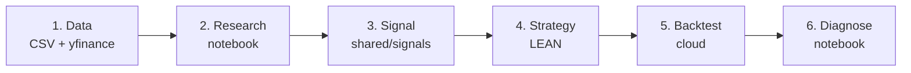

# Golden Path: A Complete Worked Example

This is the single end-to-end walkthrough the rest of the docs build toward: one hypothesis taken from raw data all the way to a backtest you can diagnose. Every command and file on this page exists in the repository today.

The worked example is **Elections × Industry Returns** — *which US industries react to a rising Trump win probability?* — because it needs no paid credentials and every stage is already shipped: the research notebook, the reusable signal, the LEAN strategy (`MyProjects/ElectionIndustryBeta`), and a diagnostics notebook.



!!! info "What runs today vs. what you build"
    **Stages 1–2 and 6 run as-is** against committed files and live yfinance —
    no account required. **Stages 3–5** are also fully implemented in
    `MyProjects/ElectionIndustryBeta`; the only thing you supply is a free
    QuantConnect account to run the cloud backtest. The point is to show the
    *shape* of a complete project, not to ship a profitable strategy.

---

## Stage 1 — The data

This example deliberately needs **no long pipeline run**. It uses two sources:

- **Trump win probability** — committed as `MyProjects/ElectionIndustryBeta/data/trump_prob.csv` (daily YES-token price for "Will Donald Trump win the 2024 US Presidential Election?", Jan–Nov 2024). It was pulled once from the Polymarket CLOB API; the algorithm itself never makes HTTP calls. Refresh it any time with:

```bash
cd MyProjects/ElectionIndustryBeta
python tools/refresh_trump_prob.py   # rewrites data/trump_prob.csv
```

- **US industry & sector ETF prices** — fetched live from yfinance inside the notebook (19 tickers: the 11 SPDR Select Sector ETFs plus Trump-themed slices XOP, ITA, KBE, IBB, ICLN, TAN, GDX, ITB).

For *other* hypotheses you would instead pull a source into the local LEAN store with one of the [data pipelines](pipelines/index.md) — that is the general Stage 1. Here the data is small and fixed (the 2024 election is over), so it lives in the repo.

---

## Stage 2 — Research the hypothesis in a notebook

Launch the committed marimo notebook. It loads `trump_prob.csv`, fetches the ETF prices, and regresses each ETF's daily return on the daily change in Trump win probability — $R_{i,t} = \alpha_i + \beta_i \cdot \Delta P(\text{Trump})_t + \varepsilon_{i,t}$ — to find which industries are most sensitive.

```bash
python -m venv infrastructure/marimo/venv
source infrastructure/marimo/venv/bin/activate
pip install -r infrastructure/marimo/requirements.txt
marimo run infrastructure/marimo/notebooks/election_industry_returns.py --port 2719
```

Open <http://localhost:2719>. This is where you decide whether the effect is real enough to trade: look at the sign, size, and statistical significance of each industry's beta on $\Delta P(\text{Trump})$. The ETFs with stable, significant betas are the ones the strategy will tilt toward. If the signal survives this stage, you formalize it as a pure function in the next step.

---

## Stage 3 — Turn the finding into a signal

A signal is pure Python in the `domain/` layer: no LEAN imports, unit-testable with plain `pytest`. The rolling-beta math from the notebook is extracted into a reusable signal at `MyProjects/shared/signals/election_beta.py` and consumed via a symlink (see [Architecture](architecture.md#shared-signals-library)).

```python
# MyProjects/shared/signals/election_beta.py  (excerpt — pure pandas/numpy)
def rolling_beta(returns, delta_prob, lookback):
    """Latest-window OLS beta of each return column on delta_prob.

    No LEAN, no I/O — importable from a plain Python env and unit-testable.
    """
    ...

def top_bottom_k_betaweighted(betas, k):
    """Long the K largest betas, short the K smallest, weights ∝ beta,
    normalised so gross exposure (sum of |weights|) == 1."""
    ...
```

Because the functions are pure, they run in CI alongside every other `pytest -m "not integration"` test — no algorithm instance required.

---

## Stage 4 — Wire the signal into a LEAN strategy

The strategy already exists at `MyProjects/ElectionIndustryBeta`, built in the **atomic structure**: a thin `main.py` composition root, organism models under `models/`, and pure logic under `domain/`.

```text
MyProjects/ElectionIndustryBeta/
├── main.py                     # composition root — wires the pieces, stays thin
├── domain/
│   ├── config.py               # UNIVERSE (19 ETFs), BENCHMARK=SPY, LOOKBACK=60, K=3, dates, CASH
│   └── signals/election_beta.py  # symlink → ../../../shared/signals/election_beta.py
└── models/
    ├── alpha.py                # organism: computes betas, emits insights
    ├── portfolio.py            # top-K long / bottom-K short, beta-weighted
    ├── execution.py            # market orders
    └── logger.py               # PortfolioLogger → ObjectStore (for Stage 6)
```

The alpha model **orchestrates** but defers the decision to the pure `rolling_beta` atom from Stage 3:

```python
# MyProjects/ElectionIndustryBeta/models/alpha.py  (excerpt)
from domain.config import LOOKBACK
from domain.signals.election_beta import rolling_beta   # symlinked from shared/

class ElectionBetaAlpha(AlphaModel):
    def betas(self, returns, delta_prob):
        return rolling_beta(returns, delta_prob, self.lookback)
```

Each market day at +5 min from open the algorithm pulls `LOOKBACK+5` days of history for the 19-ETF universe, computes each ETF's rolling beta to $\Delta P(\text{Trump})$, longs the top-K and shorts the bottom-K (weights ∝ β, 100% gross), and applies the targets with `SetHoldings`. See [Architecture](architecture.md) for what belongs in each layer.

---

## Stage 5 — Backtest in the cloud

Push the project and run a named backtest. This needs a free QuantConnect account and the LEAN CLI (see [LEAN & QuantConnect Setup](getting-started.md)).

```bash
lean cloud push --project "ElectionIndustryBeta" --force
lean cloud backtest "ElectionIndustryBeta" --name "baseline"
```

`lean cloud push` follows the signal symlink, so QuantConnect cloud sees an ordinary file. The strategy logs daily snapshots, positions, and trades to the ObjectStore via `PortfolioLogger` for the next stage.

---

## Stage 6 — Diagnose the results

Pull the backtest artifacts from the ObjectStore into the project's diagnostics notebook and compute the metrics that tell you whether the signal actually worked: P&L attribution per ETF, exposure over time, and realized performance.

```bash
marimo run MyProjects/ElectionIndustryBeta/research/pl_attribution.py
```

See [Research Examples → QuantConnect Backtest Diagnostics](research-examples.md) for the diagnostic outputs this stage produces, and [Research Recipes](research-recipes.md) for variations on the hypothesis to test next.

---

## Where to go next

- **Change the data:** swap in any source from the [Pipelines](pipelines/index.md) catalog as a richer Stage 1.
- **Change the hypothesis:** browse [Research Recipes](research-recipes.md) for ready-to-build ideas.
- **Use an agent:** [Agent Workflows](agent-workflows.md) shows how to drive these six stages with Claude Code.
