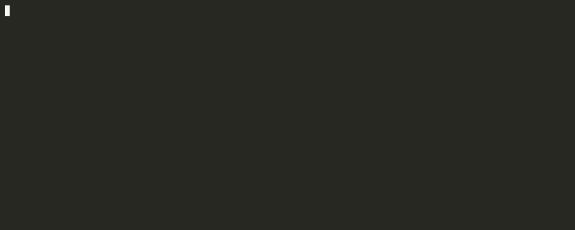

# Running the Example Notebooks

Two runnable Marimo notebooks are included in the repo. No QuantConnect account is required for either.

## Prerequisites

- Python 3.11+
- Git

## Setup

Clone the repo and install notebook dependencies:

```bash
git clone https://github.com/WolfpackOfOne/Q-agent.git
cd Q-agent
python -m venv infrastructure/marimo/venv
source infrastructure/marimo/venv/bin/activate   # Windows: venv\Scripts\activate
pip install -r infrastructure/marimo/requirements.txt
```

---

## Notebook 1: Election & Industry Returns

Explores the relationship between Trump 2024 election probability (Polymarket) and US sector/industry ETF returns (yfinance: XLE, XLF, XLV, XLI, XLK, XLP, XLY, XLU, XLB, XLRE, XLC, plus Trump-themed slices XOP, ITA, KBE, IBB, ICLN, TAN, GDX, ITB).

**All data is fetched live from public APIs — no local data required.**

```bash
source infrastructure/marimo/venv/bin/activate
marimo run infrastructure/marimo/notebooks/election_industry_returns.py --port 2719
```

Open: <http://localhost:2719>



---

## Notebook 2: Crypto & Polymarket Correlation

Explores correlations between BTC/ETH/SOL prices (Coinbase, Kraken) plus COIN (yfinance) and Polymarket prediction market prices.

**This notebook reads from local pipeline data.** Run the setup script and both pipelines before launching:

```bash
# One-time pipeline venv setup
bash infrastructure/setup.sh
source infrastructure/.venv/bin/activate

# Crypto OHLCV (Coinbase for BTC/ETH; Kraken for SOL)
python infrastructure/pipelines/crypto/scripts/run_pipeline.py --exchange coinbase
python infrastructure/pipelines/crypto/scripts/run_pipeline.py --exchange kraken --pairs SOL/USD SOL/USDT SOL/USDC

# Polymarket: snapshot market metadata, then pull YES-token price series
python infrastructure/pipelines/polymarket/scripts/run_markets_pipeline.py
python infrastructure/pipelines/polymarket/scripts/run_prices_pipeline.py --skip-existing
```

The Polymarket prices pull is incremental and resumable. For a fast smoke test, add `--limit 10` to the prices command.

Then launch the notebook:

```bash
source infrastructure/marimo/venv/bin/activate
marimo run infrastructure/marimo/notebooks/crypto_polymarket_correlation.py --port 2720
```

Open: <http://localhost:2720>

!!! note
    Charts for any exchange or market where local data is missing will render empty with a note — the notebook will not crash.

---

## Running both notebooks simultaneously

```bash
source infrastructure/marimo/venv/bin/activate
marimo run infrastructure/marimo/notebooks/election_industry_returns.py --port 2719 &
marimo run infrastructure/marimo/notebooks/crypto_polymarket_correlation.py --port 2720 &
```

| Notebook | URL |
|---|---|
| Election & Industry Returns | <http://localhost:2719> |
| Crypto & Polymarket Correlation | <http://localhost:2720> |
