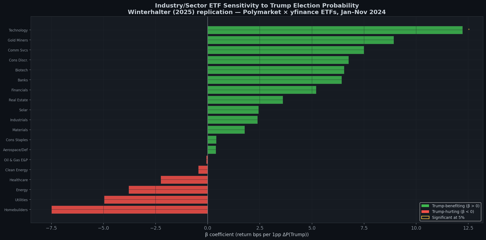
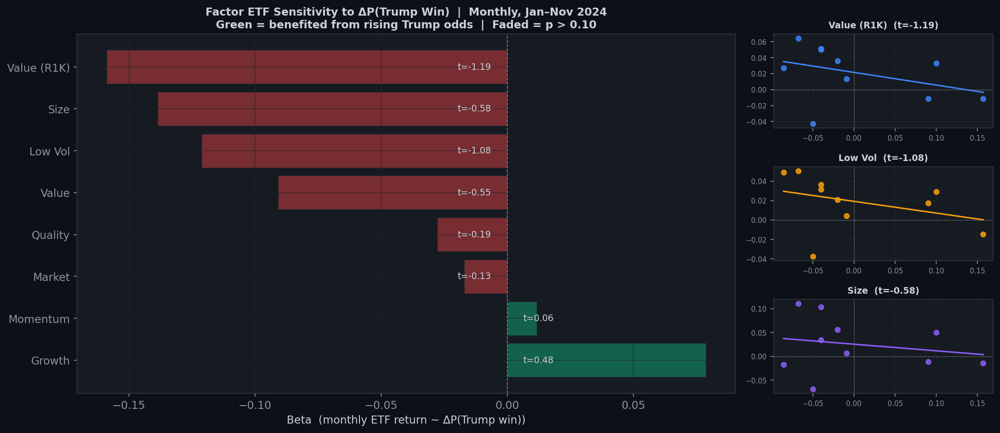

# Running the Example Notebooks

One runnable Marimo notebook is included in the repo. No QuantConnect account is required.

## Prerequisites

- Python 3.11+
- Git

## Setup

Clone the repo and install notebook dependencies:

```bash
git clone https://github.com/WolfpackOfOne/Q-agent.git
cd Q-agent
python -m venv infrastructure/marimo/venv
source infrastructure/marimo/venv/bin/activate   # Windows: venv\Scripts\activate
pip install -r infrastructure/marimo/requirements.txt
```

---

## Election & Industry Returns

Explores the relationship between Trump 2024 election probability (Polymarket) and US sector/industry ETF returns (yfinance: XLE, XLF, XLV, XLI, XLK, XLP, XLY, XLU, XLB, XLRE, XLC, plus Trump-themed slices XOP, ITA, KBE, IBB, ICLN, TAN, GDX, ITB).

**No setup beyond the venv is required.** The Trump-probability series is read from the committed `MyProjects/ElectionIndustryBeta/data/trump_prob.csv`, and the ETF prices are fetched live from yfinance.

```bash
source infrastructure/marimo/venv/bin/activate
marimo run infrastructure/marimo/notebooks/election_industry_returns.py --port 2719
```

Open: <http://localhost:2719>


### Sample outputs

**Industry & Sector ETF Sensitivity to Trump Election Probability**

OLS betas for 19 ETFs regressed on daily ΔP(Trump win). Green = Trump-benefiting, red = Trump-hurting. Stars indicate 5% significance.



**Factor ETF Sensitivity to ΔP(Trump Win)**

Monthly betas for 8 US equity factor ETFs. Faded bars have p > 0.10. Scatter insets show the top-3 ETFs by absolute t-stat.


