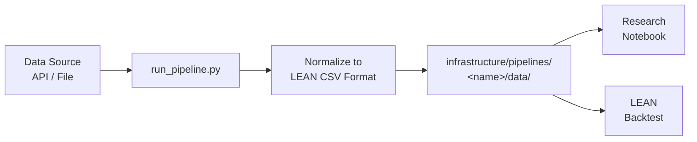

# Data Pipelines

Q-agent ships with ready-made pipelines for the most common quantitative research data sources. Each pipeline pulls data from its source, normalizes it to LEAN-compatible CSV format, and writes it to a local directory.

---

## Available pipelines

| Pipeline | Data | Credentials | Status |
|---|---|---|---|
| [Crypto](crypto.md) | BTC / ETH / SOL OHLCV (Coinbase, Kraken) | None | ✅ Available |
| [Polymarket](polymarket.md) | Prediction market YES-token prices | None | ✅ Available |
| [WRDS / CRSP](wrds.md) | 30-stock equity universe, daily 1998–present | WRDS institutional | ✅ Available |
| [SEC EDGAR](edgar.md) | Income statements, balance sheets, cash flow | None | ✅ Available |
| [yfinance](yfinance.md) | Any Yahoo Finance ticker, free | None | ✅ Available |

---

## How pipelines work

All pipelines follow the same pattern:



1. A `run_pipeline.py` script pulls from the upstream source
2. Data is normalized to LEAN's expected CSV schema
3. Output lands in `infrastructure/pipelines/<name>/data/`
4. Notebooks and backtests read from that directory

Pipeline data is **gitignored** — the scripts are committed, the data is not. Every collaborator regenerates local data by running the pipeline.

---

## LEAN CSV format

LEAN expects daily equity data in this format:

```
Date,Open,High,Low,Close,Volume
20240101,17543200,17612300,17498700,17589400,1234567890
```

- Dates: `YYYYMMDD`
- Prices: multiplied by 10,000 (LEAN's internal representation)
- Volume: integer shares

Pipelines handle this normalization automatically.

---

## Adding a new pipeline

Use the `new-pipeline-coder` agent to scaffold a new pipeline from any data source:

```bash
claude "Create a new pipeline for [data source] following the conventions
in infrastructure/pipelines/crypto/"
```

Or follow the pattern manually:

```
infrastructure/pipelines/<name>/
├── scripts/
│   └── run_pipeline.py     ← entry point
├── src/
│   └── <name>_lean/        ← package
│       ├── fetch.py
│       ├── transform.py
│       └── write.py
├── data/                   ← gitignored output
├── requirements.txt
└── README.md
```

---

## Infrastructure venv

All pipelines share a single virtual environment:

```bash
cd ~/Documents/Q-agent/infrastructure
bash setup.sh                  # one-time bootstrap
source .venv/bin/activate      # activate before running any pipeline
```
