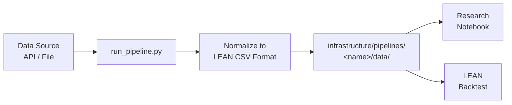

# Data Pipelines

Q-agent ships with ready-made pipelines for the most common quantitative research data sources. Each pipeline pulls data from its source, normalizes it to LEAN-compatible CSV format, and writes it to a local directory.

---

## Pipeline maturity

| Label | Meaning |
|---|---|
| **Stable** | Documented, actively used, tested end-to-end |
| **Data-committed** | Processed snapshots committed to the repo; scripts available but re-running is optional |
| **Experimental** | Scripts exist but coverage, schema, and documentation are still evolving |

---

## Fully documented pipelines

These five pipelines have dedicated docs pages, end-to-end examples, and are the
recommended starting points for new research.

| Pipeline | Data | Credentials | Maturity |
|---|---|---|---|
| [Crypto](crypto.md) | BTC / ETH / SOL OHLCV (Coinbase, Kraken) | None | **Stable** |
| [Polymarket](polymarket.md) | Prediction market YES-token prices | None | **Stable** |
| [WRDS / CRSP](wrds.md) | 30-stock equity universe, daily 1998–present | WRDS institutional | **Stable** |
| [SEC EDGAR](edgar.md) | Income statements, balance sheets, cash flow | None | **Stable** |
| [yfinance](yfinance.md) | Any Yahoo Finance ticker, free | None | **Stable** |

---

## Committed-data pipelines

These pipelines have processed snapshots committed to the repository under
`infrastructure/pipelines/<name>/data/processed/`. The notebooks that use them
work offline without re-running the scripts. Re-run the scripts to refresh.

| Pipeline | Data committed | Scripts at |
|---|---|---|
| `passive_share` | Logistic passive-share scenarios and thresholds (Haddad et al. / Brightman–Harvey calibrations) | `infrastructure/pipelines/passive_share/` |
| `etf_flows` | Broad-market ETF price/volume panel (SPY, IVV, VOO, VTI) | `infrastructure/pipelines/etf_flows/` |
| `equity_liquidity` | Demo equity liquidity panel (10-stock universe, realized vol, ADV, drawdown) | `infrastructure/pipelines/equity_liquidity/` |

These pipelines feed the [Passive Market Instability](../research-recipes/passive-market-instability-extension.md) research notebook directly.

---

## Experimental pipelines

These pipelines exist in `infrastructure/pipelines/` but documentation, schema
stability, and test coverage are still evolving. Use with caution and expect
breaking changes.

| Pipeline | Data | Notes |
|---|---|---|
| `treasury_gov_rates` | US Treasury par yield rates (treasury.gov) | Maturity: **Experimental** |
| `fixed_income` | Fixed-income and bond data | Maturity: **Experimental** |
| `macro_rates` | Macro rate series (Fed, TIPS, OIS) | Maturity: **Experimental** |

---

## How pipelines work

All pipelines follow the same pattern:



1. A `run_pipeline.py` script pulls from the upstream source
2. Data is normalized to LEAN's expected CSV schema
3. Output lands in `infrastructure/pipelines/<name>/data/`
4. Notebooks and backtests read from that directory

Pipeline data is **gitignored** — the scripts are committed, the data is not. Every collaborator regenerates local data by running the pipeline.

---

## LEAN CSV format

LEAN expects daily equity data in this format:

```
Date,Open,High,Low,Close,Volume
20240101,17543200,17612300,17498700,17589400,1234567890
```

- Dates: `YYYYMMDD`
- Prices: multiplied by 10,000 (LEAN's internal representation)
- Volume: integer shares

Pipelines handle this normalization automatically.

---

## Adding a new pipeline

Use the `new-pipeline-coder` agent to scaffold a new pipeline from any data source:

```bash
claude "Create a new pipeline for [data source] following the conventions
in infrastructure/pipelines/crypto/"
```

Or follow the pattern manually:

```
infrastructure/pipelines/<name>/
├── scripts/
│   └── run_pipeline.py     ← entry point
├── src/
│   └── <name>_lean/        ← package
│       ├── fetch.py
│       ├── transform.py
│       └── write.py
├── data/                   ← gitignored output
├── requirements.txt
└── README.md
```

---

## Infrastructure venv

All pipelines share a single virtual environment:

```bash
cd ~/Documents/Q-agent/infrastructure
bash setup.sh                  # one-time bootstrap
source .venv/bin/activate      # activate before running any pipeline
```
