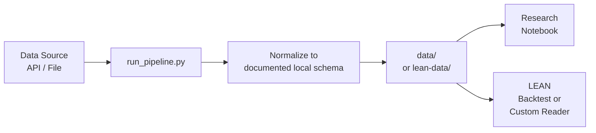

# Data Pipelines

Q-agent ships with ready-made pipelines for common quantitative research data sources. Each pipeline pulls data from its source, normalizes it into a documented local format, and makes the result available to notebooks and, where appropriate, LEAN backtests.

---

## Pipeline maturity

| Label | Meaning |
|---|---|
| **Stable** | Documented, actively used, tested end-to-end |
| **Data-committed** | Processed snapshots committed to the repo; scripts available but re-running is optional |
| **Experimental** | Scripts exist but coverage, schema, and documentation are still evolving |

---

## Output directory convention

Q-agent uses two local output conventions:

| Directory | Meaning |
|---|---|
| `data/` | Pipeline-specific raw, intermediate, or research CSV outputs |
| `lean-data/` | LEAN-ready data folders that can be pointed to from `lean.json` |

Not every pipeline writes both. For example, the crypto, yfinance, and WRDS pipelines write LEAN-ready data under `lean-data/`, while the Polymarket pipeline writes alternative-data CSVs that require project-specific reader logic.

---

## LEAN compatibility matrix

Some pipelines write native LEAN local data. Others write research CSVs used by notebooks or project-specific custom readers. Do not assume that every file under a `lean-data/` folder is a standard LEAN equity, crypto, futures, or options data file.

| Pipeline | Main output folder | Native LEAN local data? | Requires custom reader? | Notebook-only / research CSV? | Notes |
|---|---|---:|---:|---:|---|
| [Crypto](crypto.md) | `infrastructure/pipelines/crypto/lean-data/` | Yes | No | No | Writes LEAN-style crypto daily/minute zip files under `crypto/<market>/...`. |
| [yfinance](yfinance.md) | `infrastructure/pipelines/yfinance/lean-data/` | Yes | No | No | Writes daily equity zips plus factor and map files under `equity/usa/...`. |
| [WRDS / CRSP](wrds.md) | `infrastructure/pipelines/wrds/lean-data/` | Yes | No | No | Writes CRSP-derived daily equity zips plus factor and map files under `equity/usa/...`. |
| [Polymarket](polymarket.md) | `infrastructure/pipelines/polymarket/lean-data/alternative/polymarket/` | No | Yes | Yes | Writes market metadata and `datetime,price` CSVs for custom research/strategy logic, not standard LEAN data. |
| [SEC EDGAR](edgar.md) | pipeline-specific CSV outputs | No | Yes, if used in LEAN | Yes | Fundamentals and Piotroski-style outputs are research/features data, not native LEAN local data. |
| `passive_share` | `infrastructure/pipelines/passive_share/data/processed/` | No | Yes, if used in LEAN | Yes | Committed research snapshots for notebooks. |
| `etf_flows` | `infrastructure/pipelines/etf_flows/data/processed/` | No | Yes, if used in LEAN | Yes | Committed research snapshots for notebooks. |
| `equity_liquidity` | `infrastructure/pipelines/equity_liquidity/data/processed/` | No | Yes, if used in LEAN | Yes | Committed research snapshots for notebooks. |
| `treasury_gov_rates` | pipeline-specific outputs | Not confirmed | Yes, if used in LEAN | Yes | Experimental; document exact schema before using in a backtest. |
| `fixed_income` | pipeline-specific outputs | Not confirmed | Yes, if used in LEAN | Yes | Experimental; document exact schema before using in a backtest. |
| `macro_rates` | pipeline-specific outputs | Not confirmed | Yes, if used in LEAN | Yes | Experimental; document exact schema before using in a backtest. |

For new pipelines, explicitly choose one of these targets:

1. **Native LEAN data** — match a standard LEAN local-data folder and file schema.
2. **Custom LEAN data** — write documented CSVs and implement a project-specific `PythonData` reader.
3. **Notebook-only research data** — write clearly documented CSVs for Marimo notebooks and diagnostics.

---

## Fully documented pipelines

These five pipelines have dedicated docs pages, end-to-end examples, and are the recommended starting points for new research.

| Pipeline | Data | Credentials | Maturity |
|---|---|---|---|
| [Crypto](crypto.md) | BTC / ETH / SOL OHLCV (Coinbase, Kraken) | None | **Stable** |
| [Polymarket](polymarket.md) | Prediction market YES-token prices | None | **Stable** |
| [WRDS / CRSP](wrds.md) | 30-stock equity universe, daily 1998–present | WRDS institutional | **Stable** |
| [SEC EDGAR](edgar.md) | Income statements, balance sheets, cash flow | None | **Stable** |
| [yfinance](yfinance.md) | Any Yahoo Finance ticker, free | None | **Stable** |

---

## Committed-data pipelines

These pipelines have processed snapshots committed to the repository under `infrastructure/pipelines/<name>/data/processed/`. The notebooks that use them work offline without re-running the scripts. Re-run the scripts to refresh.

| Pipeline | Data committed | Scripts at |
|---|---|---|
| `passive_share` | Logistic passive-share scenarios and thresholds (Haddad et al. / Brightman–Harvey calibrations) | `infrastructure/pipelines/passive_share/` |
| `etf_flows` | Broad-market ETF price/volume panel (SPY, IVV, VOO, VTI) | `infrastructure/pipelines/etf_flows/` |
| `equity_liquidity` | Demo equity liquidity panel (10-stock universe, realized vol, ADV, drawdown) | `infrastructure/pipelines/equity_liquidity/` |

These pipelines feed the [Passive Market Instability](../research-recipes/passive-market-instability-extension.md) research notebook directly.

---

## Experimental pipelines

These pipelines exist in `infrastructure/pipelines/` but documentation, schema stability, and test coverage are still evolving. Use with caution and expect breaking changes.

| Pipeline | Data | Notes |
|---|---|---|
| `treasury_gov_rates` | US Treasury par yield rates (treasury.gov) | Maturity: **Experimental** |
| `fixed_income` | Fixed-income and bond data | Maturity: **Experimental** |
| `macro_rates` | Macro rate series (Fed, TIPS, OIS) | Maturity: **Experimental** |

---

## How pipelines work

All pipelines follow the same pattern:



1. A `run_pipeline.py` script pulls from the upstream source
2. Data is normalized into the pipeline's documented output schema
3. Output lands in `data/`, `lean-data/`, or both depending on the pipeline
4. Notebooks, native LEAN backtests, or custom readers consume those outputs

Pipeline data is generally **gitignored** — the scripts are committed, the generated data is usually not. Committed-data pipelines are the exception and are called out explicitly above.

---

## LEAN CSV and ZIP output

LEAN-ready daily equity and crypto bars use LEAN's local data conventions. Daily equity rows look like this inside the zip files:

```
Date,Open,High,Low,Close,Volume
20240101,17543200,17612300,17498700,17589400,1234567890
```

- Dates: `YYYYMMDD`
- Prices: multiplied by 10,000 for asset classes that use LEAN's scaled-price convention
- Volume: integer shares or contracts, depending on the asset class
- Location: usually `infrastructure/pipelines/<name>/lean-data/...`

Pipelines handle this normalization only when they are explicitly marked as native LEAN data writers in the compatibility matrix above. Always check the individual pipeline page for the exact path and schema.

---

## Adding a new pipeline

Use the `new-pipeline-coder` agent to scaffold a new pipeline from any data source:

```bash
claude "Create a new pipeline for [data source] following the conventions
in infrastructure/pipelines/crypto/"
```

Or follow the pattern manually:

```
infrastructure/pipelines/<name>/
├── scripts/
│   └── run_pipeline.py     ← entry point
├── src/
│   └── <name>_lean/        ← package
│       ├── fetch.py
│       ├── transform.py
│       └── write.py
├── data/                   ← raw/intermediate/research output, usually gitignored
├── lean-data/              ← native or custom LEAN-consumable output, if applicable
├── requirements.txt
└── README.md
```

---

## Infrastructure venv

All pipelines share a single virtual environment:

```bash
cd ~/Documents/Q-agent/infrastructure
bash setup.sh                  # one-time bootstrap
source .venv/bin/activate      # activate before running any pipeline
```
